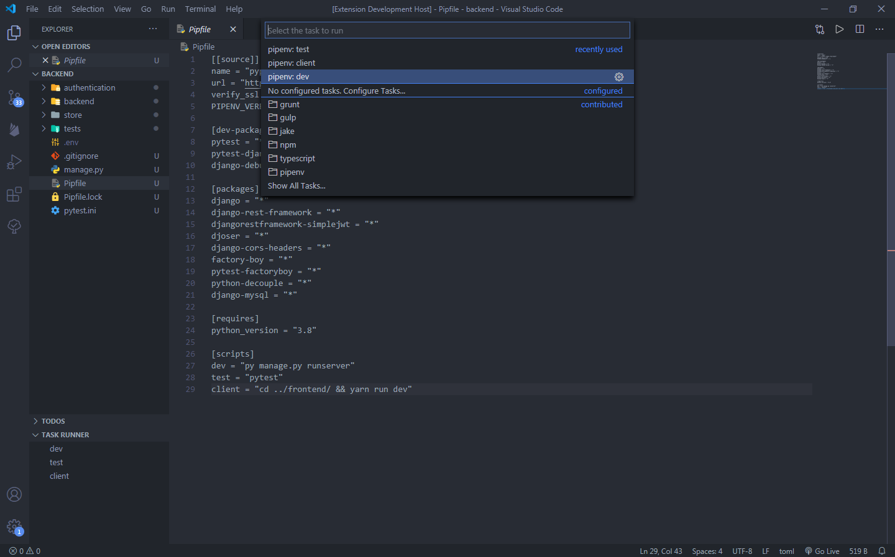
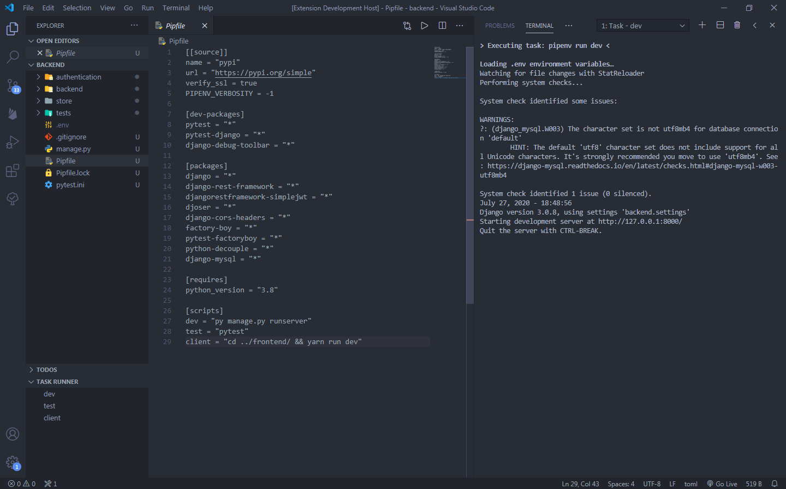

# Pipenv Scripts

Register Pipenv scripts as tasks to run from the command palette or your favourite task-running extension

## Features

 - Automatic detection and parsing of Pipfile in the workspace
 - Registration of all scripts listed under the [scripts] section in Pipfile

## Usage

1. Open a directory containing a Pipfile
2. Open the command palette
3. Run `Tasks: Run Task` and select a script to run
4. Alternatively, run the task from any third party extension

  

### 1.0.0

Initial release 

